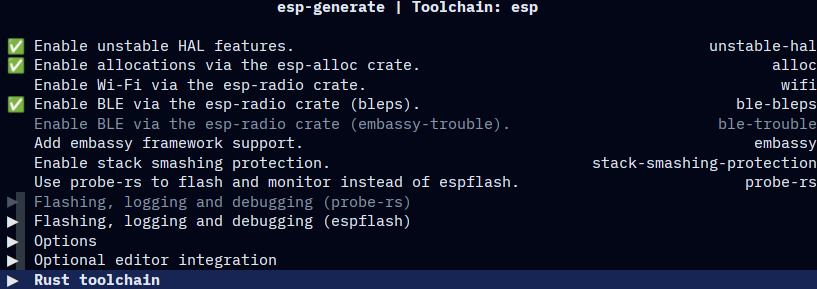
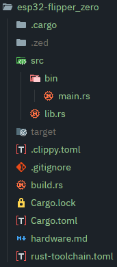

+++
date = '2026-03-21'
lastmod = '2026-03-21'
draft = false
title = '[WIP] ESP32 Flipper Zero: BLE Spamming Attack'
tags = ['WIP', 'ESP32', 'BLE', 'Security']
+++

I am still working on this project, but I wanted to share my progress so far. This is a work in progress and I will update this post when I have more time to work on it.

### Intro
The reason why I started this project, is because I have a bunch of unused single board computers lying around from school. Which, I am not currently using.   
I thought it was kind of a waste to not use them and thought, "Hey, let's see what I can recreate with these boards."

So, I decided to start with the ESP32 I have lying around, and see if I could re-create the BLE spamming attack function from the Flipper Zero.

The specific hardware I have is a Joy-IT SBC-NodeMCU-ESP32-C (Xtensa ESP32-WROOM-32 CPU) development board.

When starting off, I decided to challenge myself by using no_std Rust. This means I am writing bare-metal Rust instead of the more common C on top of the ESP-IDF framework which runs on top of FreeRTOS. This means I have direct access to the hardware using esp-hal which acts as a translation layer between rust code and the espressif hardware.

### Setup
I first installed my dependencies. I need `espflash` to be able to flash the code onto the ESP32.   
I also installed `esp-generate` to have an easy starter template I can build upon.   
Lastly I installed `espup` to manage the toolchain and set up the environment for the ESP32. (This is basically a variant of rustup but for the ESP32)

(Yes, I use arch btw)
```bash
paru -S espflash esp-generate espup
```

After installing everything I need with `espup install` and setting it up in my environment.   

I could finally set up the project using `esp-generate`.
```bash
esp-generate --chip esp32 esp32-flipper_zero
```



Here I enabled unstable HAL feature, to be able to talk to the `esp-radio` crate. This allows me to control the Bluetooth directly.   
According to the [docs](https://docs.espressif.com/projects/rust/esp-radio/0.17.0/esp32/esp_radio/index.html) it is also recommended to enable `esp-alloc`, which I also did. This allows me to use the Heap (dynamic memory) which is required for Bluetooth.   
Finally I enabled [bleps](https://github.com/bjoernQ/bleps) as my bluetooth stack. The reason why I chose bleps over [TrouBLE](https://github.com/embassy-rs/trouble) is because I do not need async for this project and I want to keep it as simple as possible. (Even though I chose bare-metal rust... )

Then under the Rust toolchain I chose to use the `esp` toolchain. This is important for Rust to be able to build and run for the ESP32 using the Espressif Rust compiler (which I downloaded via `espup`) instead of the default one. Since the default Rust compiler does not support the Xtensa CPU architecture of the ESP32.


Finally, I can generate the project and start coding!

### How does it work?

When building our project, Cargo sees our defined CPU architecture, Xtensa, from the `.cargo/config.toml` and prepares the toolchain we installed.   
Cargo also sees our `Cargo.toml` which contains all the dependencies and features we want to use.   
At the start of the build process, Cargo looks at `build.rs`.   
This file tells Cargo to use the [`linkall.x`](https://esp32.implrust.com/std-to-no-std/linker-script.html) file as our linker script. This file defines the memory layout of our application. Apart from the Linker, `build.rs` also acts as a basic error handler when building.

Now, during the build process,our compiler knows what to use and where everything is in memory. It compiles the code and links it together. The binary file that gets created can now be flashed onto the ESP32's flash memory.

But how does the ESP32 work with this binary file? How does it know how to execute this code?

After flashing the binary file onto the ESP32, we can power it on. This runs the default ESP32 bootloader.   
This bootloader reads a specific address in ROM (read-only-memory) and
loads the second stage bootloader. ([`esp-bootloader-esp-idf`](https://docs.espressif.com/projects/rust/esp-bootloader-esp-idf/0.4.0/esp32/esp_bootloader_esp_idf/index.html))   
This secondary bootloader then copies the application binary from Flash memory to RAM.   
We then jump to our defined entry point inside `main.rs` called `#[main]` and execute our code.

I hope this explanation makes the following folder structure and code easier to understand.



### The Code

WIP


<!--### BLE Protocol
Before actually starting to code, I wanted to understand the BLE protocol a bit more in depth.

According to the [BLE Spec](https://www.bluetooth.com/bluetooth-le-primer/#mcetoc_1iiprfme5c), BLE operates in the 2400MHZ to 2483.5MHZ frequency range, which is divided into 40 channels. Each channel is 2MHz wide. There are 3 advertising channels (37,38,39) and the other 37 are data channels. 

These advertising channels are interesting for me since they are used for spamming attacks. (This is explained in depth [here](https://www.ellisys.com/technology/edu_bt01_lecomm_ch03_advbl.pdf))-->
